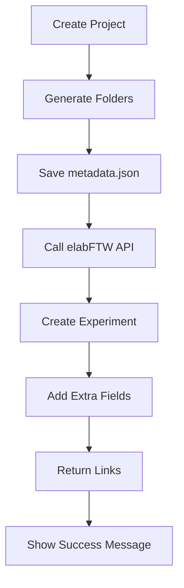

# elabFTW Integration

elabFTW is a popular electronic lab notebook that helps researchers organize their experiments digitally. MetaFold's elabFTW integration automatically creates experiments in your lab notebook with all metadata from your MetaFold projects.

## What You'll Get

✅ **Automatic Experiment Creation** - Every MetaFold project creates a corresponding elabFTW experiment  
✅ **Metadata Synchronization** - All your template metadata becomes searchable elabFTW extra fields  
✅ **Direct Links** - Quick access from MetaFold to your elabFTW experiments  
✅ **Bidirectional Workflow** - Start in MetaFold, continue in elabFTW  
✅ **Team Collaboration** - Share structured experiments with your research group  

## Prerequisites

Before setting up the integration, ensure you have:

- **elabFTW Account** - Access to an elabFTW server (v4.0+ recommended)
- **API Access** - Permission to create API keys in your elabFTW account
- **Team Membership** - Belonging to at least one team in elabFTW
- **Internet Connection** - For API communication between MetaFold and elabFTW

## Setup Guide

### Step 1: Create elabFTW API Key

1. **Log into elabFTW**
   - Open your elabFTW server in a web browser
   - Sign in with your credentials

2. **Navigate to User Settings**
   - Click on your username (top right)
   - Select **"User Panel"** or **"Settings"**

   

3. **Access API Keys Section**
   - Look for **"API Keys"** tab or section
   - Click **"Create new API key"**

4. **Configure API Key**
   - **Name**: Enter "MetaFold Integration"
   - **Permissions**: Ensure "Write" access is enabled
   - **Expiration**: Set appropriate expiration (1 year recommended)
   - Click **"Create"**

   

5. **Copy API Key**
   - **Important**: Copy the API key immediately
   - Store it securely - it won't be shown again
   - The key looks like: `3f7a2b8c9d1e4f5g6h7i8j9k0l1m2n3o`

   

### Step 2: Configure MetaFold

1. **Open MetaFold Settings**
   - Launch MetaFold
   - Navigate to **⚙️ Settings** tab
   - Click on **"elabFTW"** section

   

2. **Enter Connection Details**
   - **Server URL**: Your elabFTW server address (e.g., `https://elabftw.example.com`)
   - **API Key**: Paste the API key you copied earlier
   - **Auto-Sync**: Enable if you want automatic experiment creation

   

3. **Test Connection**
   - Click **"Test Connection"** button
   - Wait for the test to complete
   - You should see a green success message

   

4. **Advanced Settings** (Optional)
   - **Default Experiment Type**: Choose your preferred experiment type
   - **Team Selection**: Select which elabFTW team to use
   - **Field Mapping**: Customize how metadata maps to elabFTW fields

5. **Save Configuration**
   - Click **"Save Settings"**
   - Your integration is now ready!

### Step 3: Verify Setup

Create a test project to ensure everything works:

1. **Create Simple Template** (if you don't have one)
   - Basic experiment template with a few metadata fields
   - Include fields like "Title", "Description", "Date"

2. **Create Test Project**
   - Use your template
   - Enable elabFTW integration
   - Fill in metadata
   - Create the project

3. **Check elabFTW**
   - Log into your elabFTW server
   - Look for the new experiment
   - Verify metadata appears in extra fields

## Using the Integration

### Creating Projects with elabFTW Sync

1. **Enable Integration**
   - In the **🚀 Create Project** tab
   - Check the **"Sync with elabFTW"** option
   - The elabFTW logo should appear with a green status indicator

   

2. **Configure Integration Options**
   - **Experiment Type**: Choose appropriate type (Experiment, Protocol, etc.)
   - **Team**: Select target team (if you belong to multiple)
   - **Tags**: Add optional tags for organization

   

3. **Fill Metadata Form**
   - Complete all metadata fields as usual
   - All fields will become searchable extra fields in elabFTW
   - Required fields must be completed

4. **Create Project**
   - Click **"Create Project"**
   - MetaFold will:
     - Create the folder structure
     - Generate metadata files
     - Create elabFTW experiment
     - Link everything together

### What Happens During Creation

**Behind the Scenes**:

1. **Project Folder Creation** - Standard MetaFold folder structure
2. **Metadata File** - `elabftw-metadata.json` saved locally
3. **elabFTW API Call** - Creates new experiment via REST API
4. **Extra Fields Population** - Metadata becomes searchable elabFTW fields
5. **Link Generation** - Direct URL to the elabFTW experiment

### Success Confirmation

After successful creation, you'll see:

- **✅ Project Created** - Local folder structure ready
- **✅ elabFTW Experiment** - Clickable link to open in browser
- **📄 Metadata Synced** - All fields transferred successfully
- **🔗 Integration ID** - Reference number for troubleshooting

## Working with elabFTW Experiments

### Accessing Your Experiments

**From MetaFold**:
- Success message includes direct link
- Project Scanner shows elabFTW links for existing projects
- Settings page provides quick access to your elabFTW server

**From elabFTW**:
- Standard elabFTW interface
- All metadata appears as extra fields
- Searchable and filterable
- Full elabFTW editing capabilities

### Metadata Mapping

MetaFold metadata fields map to elabFTW extra fields:

| MetaFold Field Type | elabFTW Extra Field Type | Notes |
|-------------------|------------------------|-------|
| Text | Text | Direct mapping |
| Textarea | Text | Multi-line preserved |
| Number | Number | Validation maintained |
| Date | Date | ISO format used |
| Dropdown | Select | Options preserved |
| Checkbox | Checkbox | Boolean conversion |
| File | Text | File path stored |

### Editing and Updates

**Important**: MetaFold → elabFTW sync is **one-way** during project creation.

- **Editing in elabFTW**: Full editing capabilities in elabFTW interface
- **Editing Metadata**: Changes in elabFTW don't sync back to MetaFold
- **Best Practice**: Use elabFTW as your primary experiment documentation tool after creation

### Search and Organization

Your MetaFold metadata becomes fully searchable in elabFTW:

**Search by Metadata**:
- Use elabFTW's advanced search
- Filter by extra field values
- Search across all experiments

**Organization**:
- Add tags in elabFTW for additional organization
- Use elabFTW categories and status
- Link related experiments

## Advanced Features

### Custom Field Mapping

For advanced users, customize how MetaFold fields map to elabFTW:

1. **Open Advanced Settings**
   - In elabFTW integration settings
   - Click **"Advanced Field Mapping"**

2. **Configure Mappings**
   - Map specific MetaFold fields to custom elabFTW field names
   - Set field types and validation rules
   - Configure default values

### Team Management

If you belong to multiple elabFTW teams:

1. **Select Default Team**
   - Choose your primary research group
   - All experiments will be created in this team by default

2. **Per-Project Team Selection**
   - Override default team during project creation
   - Useful for collaborative projects
   - Team members can access the experiment

### Batch Operations

For multiple projects:

1. **Template Integration Settings**
   - Configure elabFTW settings at template level
   - All projects from template inherit settings
   - Consistent experiment types and tags

2. **Bulk Creation**
   - Use Project Scanner to find unsynced projects
   - Batch sync existing projects to elabFTW
   - Mass organization and tagging

## Troubleshooting

### Common Issues

**❌ Connection Test Failed**

*Symptoms*: Red error message when testing connection

*Solutions*:
- Verify server URL (include `https://`)
- Check API key for typos
- Ensure API key has write permissions
- Confirm elabFTW server is accessible from your network

**❌ Experiment Creation Failed**

*Symptoms*: Project created locally but no elabFTW experiment

*Solutions*:
- Check elabFTW permissions (can you create experiments manually?)
- Verify team membership
- Check for required fields in elabFTW
- Review MetaFold logs for specific error messages

**❌ Metadata Not Appearing**

*Symptoms*: Experiment created but extra fields are empty

*Solutions*:
- Verify metadata form was completed
- Check field mapping configuration
- Ensure elabFTW allows extra fields
- Review field type compatibility

**❌ Wrong Team/Category**

*Symptoms*: Experiment in wrong team or has wrong settings

*Solutions*:
- Check team selection in MetaFold settings
- Verify default experiment type configuration
- Update template integration settings
- Move experiment in elabFTW if necessary

### Debug Information

For troubleshooting support, gather this information:

**MetaFold Information**:
- MetaFold version
- Error messages from creation process
- Template configuration used
- Integration settings (without API key)

**elabFTW Information**:
- elabFTW server version
- User permissions and team memberships
- API key permissions
- Server logs (if accessible)

### Getting Help

**Self-Help Resources**:
- Check MetaFold logs in Settings > Debug
- Test connection with minimal data first
- Try creating experiment manually in elabFTW

**Support Channels**:
- MetaFold documentation and FAQ
- NFDI4BioImage support team
- elabFTW community and documentation

## Best Practices

### Template Design for elabFTW

**Good Metadata Fields**:
- Clear, descriptive field names
- Logical field types (number for numeric data)
- Reasonable field lengths
- Required fields only for essential data

**elabFTW-Friendly Naming**:
- Use alphanumeric characters
- Avoid special characters in field names
- Consider elabFTW search functionality

### Workflow Integration

**Recommended Workflow**:
1. **Plan in MetaFold** - Design experiment structure and metadata
2. **Create Project** - Use MetaFold to generate organized structure
3. **Document in elabFTW** - Continue detailed documentation in elabFTW
4. **Analyze Results** - Link data files and analysis in elabFTW
5. **Share and Collaborate** - Use elabFTW's sharing features

### Security Considerations

**API Key Security**:
- Store API keys securely (MetaFold uses encrypted storage)
- Set reasonable expiration dates
- Revoke old keys when changing systems
- Don't share API keys with others

**Data Privacy**:
- Understand your elabFTW server's data policies
- Consider sensitive data handling procedures
- Use elabFTW's privacy settings appropriately

## Next Steps

Now that elabFTW integration is set up:

- **[Try OMERO Integration](omero-integration.md)** for image data management
- **[Learn Combined Workflows](combined-integrations.md)** using both elabFTW and OMERO
- **[Explore Project Discovery](project-scanner.md)** to find and organize existing projects
- **[Advanced Template Design](templates.md)** optimized for lab notebook integration

---

*With elabFTW integration, your research organization becomes seamlessly digital!*