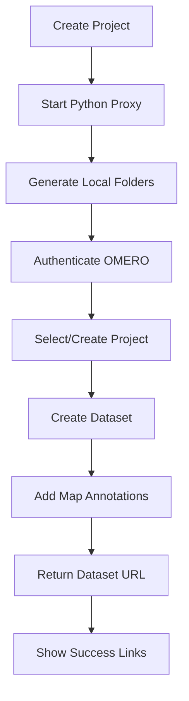

# OMERO Integration

OMERO is a powerful platform for managing and analyzing biological image data. MetaFold's OMERO integration automatically creates datasets in your OMERO server with searchable metadata annotations, making your microscopy experiments fully traceable and discoverable.


## What You'll Get

✅ **Automatic Dataset Creation** - Every MetaFold project creates a corresponding OMERO dataset  
✅ **Searchable Metadata** - All your template metadata becomes searchable OMERO map annotations  
✅ **Project Linking** - Connect to existing OMERO projects or create new ones  
✅ **Group Integration** - Respect your OMERO group permissions and workflows  
✅ **Direct Access** - Quick links from MetaFold to your OMERO datasets  
✅ **Image Organization** - Structured approach to organizing your imaging data  

## Prerequisites

Before setting up OMERO integration, ensure you have:

- **OMERO Account** - Access to an OMERO server (5.6+ recommended)
- **OMERO.web Access** - Web interface enabled on your OMERO server
- **Group Membership** - Belonging to at least one OMERO group
- **Dataset Permissions** - Ability to create datasets in your group
- **Network Access** - Connection to OMERO server from MetaFold


## OMERO Setup Requirements

### Python Proxy Server

OMERO integration requires a Python proxy server to handle CORS (Cross-Origin Resource Sharing) restrictions:

1. **Python Installation**
   - Python 3.7+ required
   - pip package manager
   - Virtual environment recommended

2. **Install Dependencies**
   ```bash
   pip install requests flask flask-cors
   ```

3. **Proxy Server Location**
   - MetaFold includes `omero_proxy.py`
   - Usually located in the main MetaFold directory
   - Can be run from command line


### Server Information

Gather this information from your OMERO administrator:

- **OMERO.web URL**: Your OMERO web interface address (e.g., `https://omero.example.com`)
- **Server Name**: OMERO server identifier
- **Port**: Usually 4064 (secure) or 4063 (insecure)
- **Group Names**: Which groups you belong to
- **Permissions**: Your access level in each group


## Setup Guide

### Step 1: Start Python Proxy Server

1. **Open Command Line/Terminal**
   - Windows: Command Prompt or PowerShell
   - macOS/Linux: Terminal

2. **Navigate to MetaFold Directory**
   ```bash
   cd /path/to/MetaFold
   ```

3. **Start Proxy Server**
   ```bash
   python omero_proxy.py --port 8000 --omero-server https://your-omero-server.com
   ```

   

4. **Verify Proxy Running**
   - You should see: "Proxy server running on http://localhost:8000"
   - Keep this terminal window open while using MetaFold
   - The proxy must run continuously for OMERO integration

### Step 2: Configure MetaFold OMERO Settings

1. **Open MetaFold Settings**
   - Launch MetaFold
   - Navigate to **⚙️ Settings** tab
   - Click on **"OMERO"** section

   

2. **Enter Server Details**
   - **OMERO Server URL**: Your OMERO.web address
   - **Proxy URL**: `http://localhost:8000` (default)
   - **Username**: Your OMERO username
   - **Password**: Your OMERO password

   

3. **Test Connection**
   - Click **"Test Connection"** button
   - Wait for authentication and group discovery
   - You should see available groups listed

   

4. **Select Default Group**
   - Choose your primary research group
   - This determines dataset permissions
   - Can be changed per-project during creation

5. **Advanced Settings** (Optional)
   - **Auto-Sync**: Enable automatic dataset creation
   - **Default Project**: Select existing OMERO project (or create new)
   - **Annotation Prefix**: Customize metadata annotation naming

6. **Save Configuration**
   - Click **"Save Settings"**
   - Green success message confirms settings saved

### Step 3: Verify OMERO Setup

Test the integration with a simple project:

1. **Create Test Template**
   - Simple experiment template
   - Include basic metadata fields (Title, Description, Date)

2. **Create Test Project**
   - Enable OMERO integration during creation
   - Fill metadata form
   - Complete project creation

3. **Check OMERO.web**
   - Log into your OMERO web interface
   - Navigate to your group and project
   - Verify new dataset appears with map annotations


## Using OMERO Integration

### Creating Projects with OMERO Sync

1. **Enable OMERO Integration**
   - In **🚀 Create Project** tab
   - Check **"Sync with OMERO"** option
   - OMERO logo appears with connection status

   

2. **Configure OMERO Options**
   - **Group**: Select target OMERO group
   - **Project**: Choose existing project or create new
   - **Dataset Name**: Customize dataset name (defaults to project name)

   

3. **Fill Metadata Form**
   - Complete all metadata fields
   - All fields become OMERO map annotations
   - Required fields must be completed for OMERO sync

4. **Create Project**
   - Click **"Create Project"**
   - MetaFold will:
     - Create local folder structure
     - Generate metadata files
     - Authenticate with OMERO
     - Create dataset with map annotations
     - Return direct links

### OMERO Creation Workflow



**Detailed Process**:

1. **Local Creation** - Standard MetaFold folder structure
2. **OMERO Authentication** - Secure login via proxy server
3. **Group Selection** - Use configured group permissions
4. **Project Management** - Link to existing or create new OMERO project
5. **Dataset Creation** - New dataset with descriptive name
6. **Map Annotations** - All metadata becomes searchable annotations
7. **Link Generation** - Direct URLs to OMERO.web interface


### Success Confirmation

After successful OMERO integration:


- **✅ Local Project Created** - Folder structure ready for data
- **✅ OMERO Dataset Created** - Clickable link to OMERO.web
- **📋 Map Annotations Added** - All metadata searchable in OMERO
- **🔗 Direct Links** - Quick access to dataset and project
- **🏷️ Integration ID** - OMERO dataset ID for reference

## Working with OMERO Datasets

### Accessing Your Datasets

**From MetaFold**:
- Success message includes direct OMERO.web links
- Project Scanner shows OMERO links for existing projects
- Settings provide quick access to OMERO server

**From OMERO.web**:
- Standard OMERO interface navigation
- Datasets appear in selected project
- Map annotations visible in right panel
- Full OMERO functionality available


### Metadata as Map Annotations

MetaFold metadata becomes OMERO map annotations:

| MetaFold Field | OMERO Map Annotation | Example |
|---------------|---------------------|---------|
| Title | MetaFold_Title | "Cell Migration Assay #3" |
| Description | MetaFold_Description | "Testing drug effects..." |
| Date | MetaFold_Date | "2025-06-13" |
| Sample_Type | MetaFold_Sample_Type | "HeLa cells" |
| Temperature | MetaFold_Temperature | "37" |


### Image Upload and Organization

**Recommended Workflow**:

1. **Create MetaFold Project** - Generates OMERO dataset
2. **Acquire Images** - Save to project folders
3. **Upload to OMERO** - Use OMERO.insight or command line tools
4. **Link Images** - Import images into the pre-created dataset
5. **Analysis** - Use OMERO analysis tools with structured metadata

### Searching and Filtering

Your MetaFold metadata enables powerful OMERO searches:

**Search by Map Annotations**:
- Use OMERO.web advanced search
- Filter by annotation keys and values
- Find datasets with specific experimental parameters

**Example Searches**:
- All datasets with `MetaFold_Sample_Type: "HeLa cells"`
- Experiments between specific dates
- Projects with particular microscopy settings


## Advanced OMERO Features

### Project Management

**Linking to Existing Projects**:
1. **Select Existing Project** during MetaFold project creation
2. **Benefits**: Organize related experiments together
3. **Permissions**: Inherit project-level permissions

**Creating New Projects**:
1. **Auto-Creation**: MetaFold creates new OMERO project
2. **Naming**: Uses MetaFold project name or custom name
3. **Description**: Includes MetaFold template information


### Group and Permission Management

**Group Selection**:
- Choose appropriate OMERO group during setup
- Affects dataset visibility and collaboration
- Can be different from default group per project

**Permission Levels**:
- **Private**: Only you can see the dataset
- **Read-only**: Group members can view
- **Read-annotate**: Group members can add annotations
- **Read-write**: Group members can modify


### Bulk Operations

**Multiple Dataset Creation**:
1. **Template-Based Workflow** - Configure OMERO settings in template
2. **Batch Processing** - Create multiple projects with same OMERO settings
3. **Consistent Organization** - All datasets follow same structure

**Existing Project Integration**:
1. **Project Scanner Integration** - Find existing MetaFold projects
2. **Retroactive OMERO Sync** - Add OMERO datasets for old projects
3. **Bulk Annotation** - Add map annotations to existing datasets

## Troubleshooting

### Common Issues

**❌ Proxy Server Not Running**

*Symptoms*: Connection failed, proxy errors in MetaFold

*Solutions*:
- Ensure Python proxy server is running
- Check proxy server terminal for error messages
- Verify proxy URL in MetaFold settings (`http://localhost:8000`)
- Restart proxy server if needed


**❌ OMERO Authentication Failed**

*Symptoms*: Login errors, authentication timeouts

*Solutions*:
- Verify username and password in OMERO.web
- Check OMERO server URL (must include https://)
- Confirm user account is active and not locked
- Test login directly in OMERO.web

**❌ No Groups Available**

*Symptoms*: Empty group list during connection test

*Solutions*:
- Verify user belongs to at least one OMERO group
- Check group permissions with OMERO administrator
- Ensure user has dataset creation rights
- Try logging into OMERO.web to confirm groups

**❌ Dataset Creation Failed**

*Symptoms*: Local project created but no OMERO dataset

*Solutions*:
- Check group permissions for dataset creation
- Verify sufficient disk space on OMERO server
- Review proxy server logs for specific errors
- Confirm OMERO server is accessible and responsive

**❌ Map Annotations Missing**

*Symptoms*: Dataset created but no metadata annotations

*Solutions*:
- Verify all metadata fields were completed
- Check for special characters in field names
- Ensure annotation permissions in OMERO group
- Review OMERO server annotation limits


### Proxy Server Troubleshooting

**Starting Proxy Issues**:
```bash
# Check if port is already in use
netstat -tulpn | grep :8000

# Use different port if needed
python omero_proxy.py --port 8001 --omero-server https://your-server.com

# Update MetaFold proxy URL accordingly
```

**Connection Issues**:
- Verify OMERO server URL includes protocol (https://)
- Check firewall settings blocking proxy server
- Ensure no antivirus blocking Python networking
- Try running as administrator (Windows) or sudo (Linux/macOS)

### Debug Information

For support, collect this information:

**MetaFold Debug Info**:
- MetaFold version and operating system
- Proxy server output and error messages
- MetaFold error logs from Settings > Debug
- OMERO integration settings (without passwords)

**OMERO Server Info**:
- OMERO server version
- User groups and permissions
- OMERO.web configuration
- Server administrator contact


## Best Practices

### Template Design for OMERO

**Metadata Field Design**:
- Use descriptive, searchable field names
- Avoid special characters (stick to alphanumeric + underscore)
- Include key experimental parameters
- Consider OMERO annotation search capabilities

**Example Good Fields**:
- `Sample_Type`, `Microscope_Model`, `Objective_Magnification`
- `Excitation_Wavelength`, `Emission_Filter`, `Exposure_Time`
- `Date_Acquired`, `Experimenter_Name`, `Protocol_Version`

### OMERO Workflow Integration

**Recommended Complete Workflow**:

1. **Plan Experiment** - Design in MetaFold with appropriate template
2. **Create Project** - Generate structure and OMERO dataset
3. **Acquire Data** - Collect images/data into project folders
4. **Upload to OMERO** - Import data into pre-created dataset
5. **Analyze** - Use OMERO analysis tools with structured metadata
6. **Share** - Use OMERO sharing features with organized datasets

### Security and Access Control

**Credential Security**:
- Use MetaFold's secure credential storage
- Set strong OMERO passwords
- Consider OMERO session timeouts
- Regularly review group memberships

**Data Organization**:
- Use consistent naming conventions
- Organize projects logically in OMERO
- Set appropriate group permissions
- Document dataset purposes clearly

### Performance Optimization

**Large Datasets**:
- Plan folder structures for large image sets
- Consider OMERO import performance
- Use OMERO's parallel import features
- Monitor server disk space

**Network Considerations**:
- Ensure stable network connection during creation
- Consider VPN requirements for remote access
- Plan for OMERO server maintenance windows

## Integration with Other Tools

### OMERO + elabFTW Workflow

When using both integrations:

1. **MetaFold Project Creation** - Creates both elabFTW experiment and OMERO dataset
2. **Cross-Referencing** - Link elabFTW experiment to OMERO dataset URLs
3. **Comprehensive Documentation** - Lab notebook entries reference organized image data
4. **Team Collaboration** - Share both lab notes and image datasets

### Third-Party Tools

**Image Analysis**:
- ImageJ/FIJI plugins for OMERO
- CellProfiler OMERO integration
- Custom analysis scripts using OMERO APIs

**Data Export**:
- OMERO command-line tools
- Custom export scripts
- Integration with institutional repositories

## Next Steps

Now that OMERO integration is configured:

- **[Learn Combined Workflows](combined-integrations.md)** using both elabFTW and OMERO together
- **[Explore Project Discovery](project-scanner.md)** to find and organize existing projects
- **[Advanced Template Design](templates.md)** optimized for image data management
- **[Data Visualization](data-visualization.md)** of your organized research structure

---

*With OMERO integration, your image data becomes part of a fully organized, searchable research ecosystem!*